# DOGERAY
CUDA path tracer from scratch!
The original name of the project was RAYGPU so thats why you see that around.
Still WIP.
Almost all the code is in kernel.cu

Requires CUDA and SDL2

tracker here: https://github.com/users/PhilipPragerUrbina/projects/1
###
Gallery:

    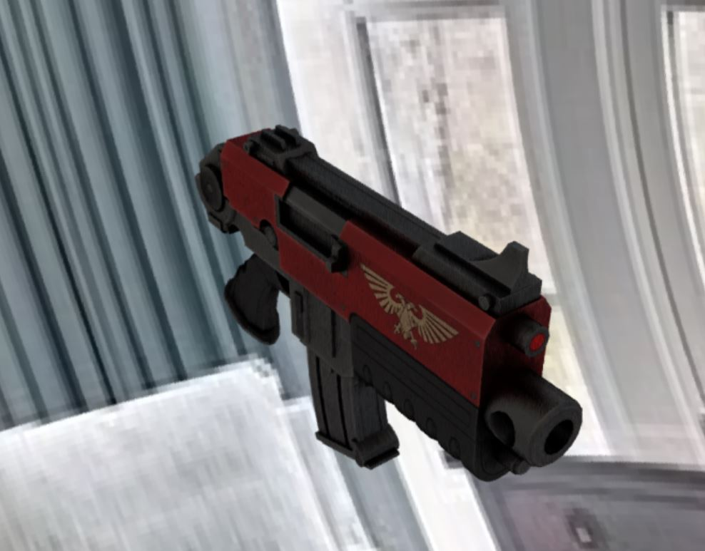
   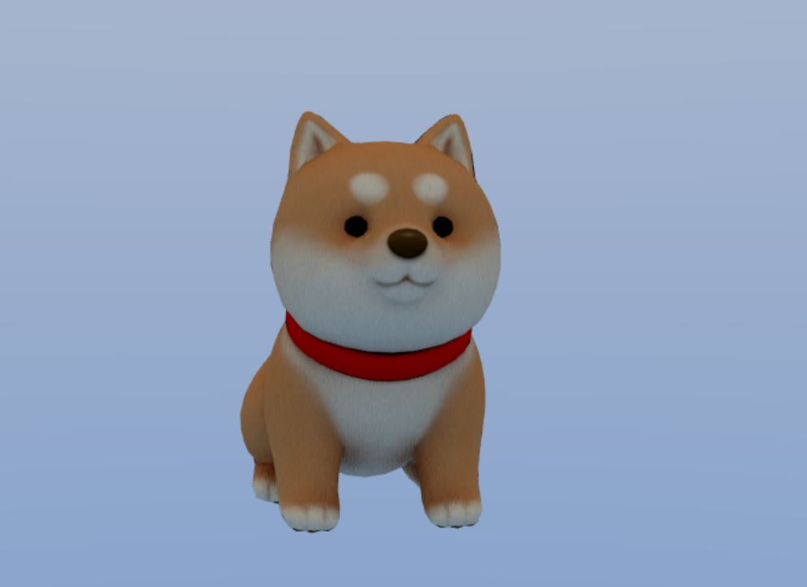
     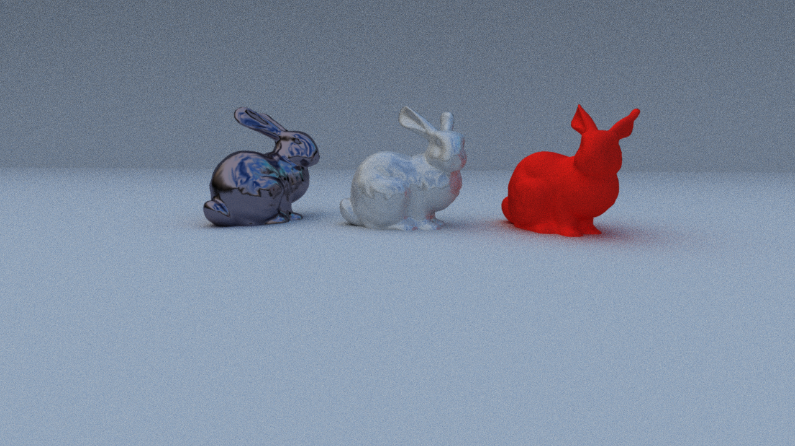
  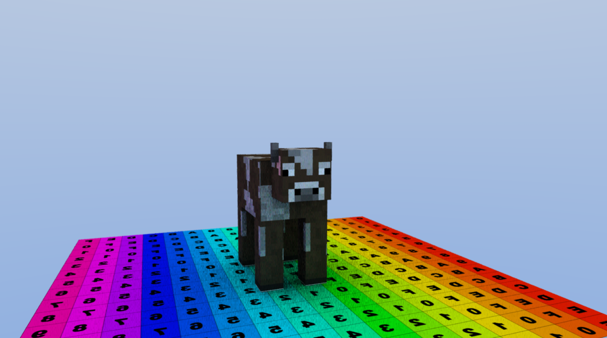
   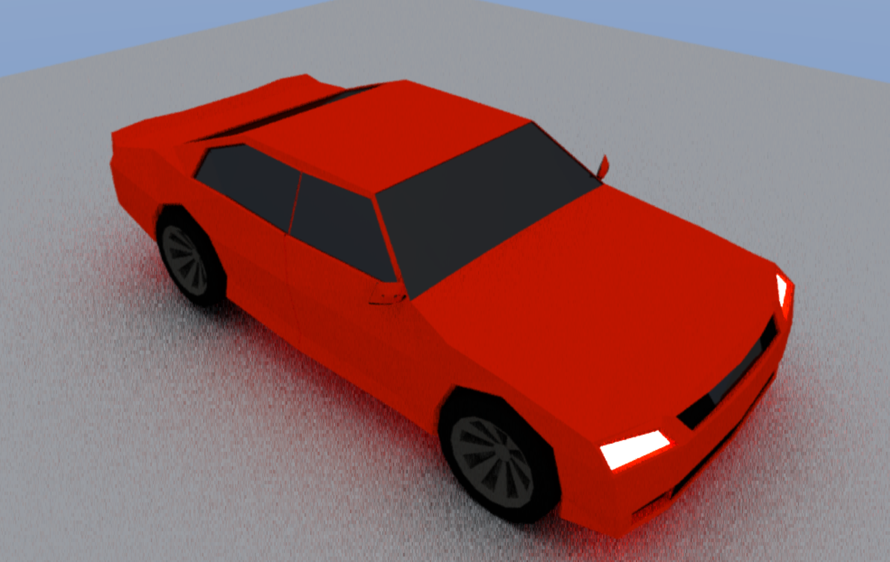
   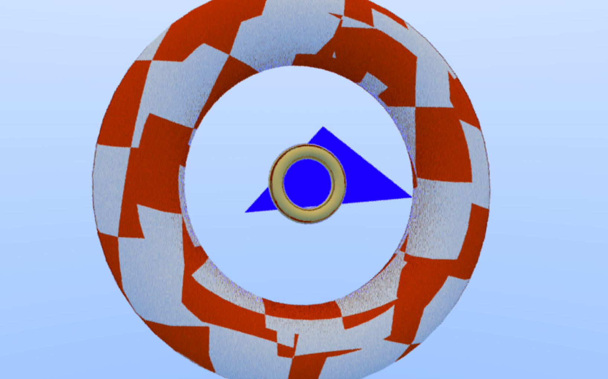
   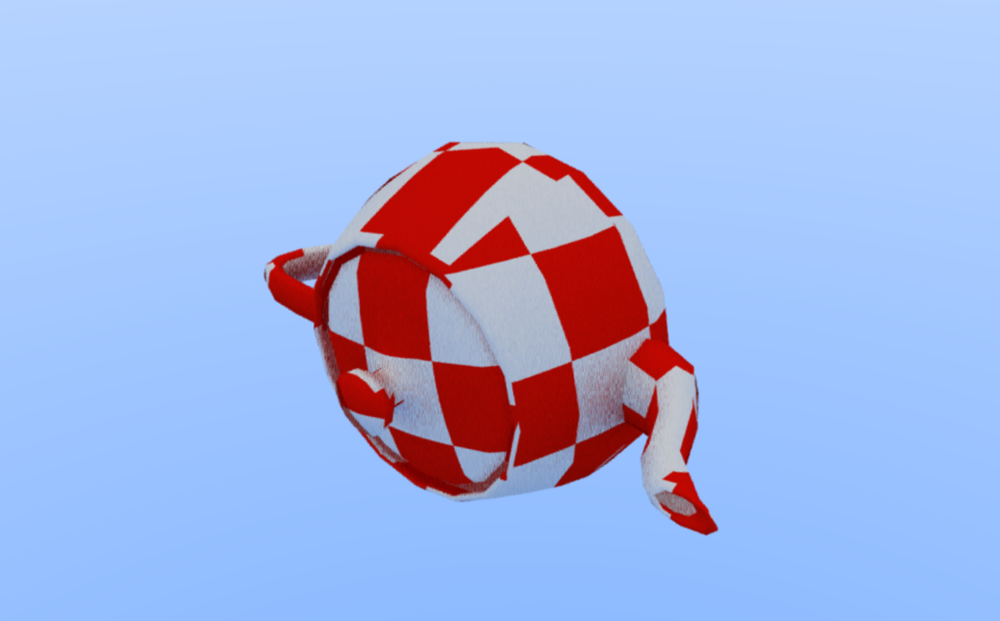
    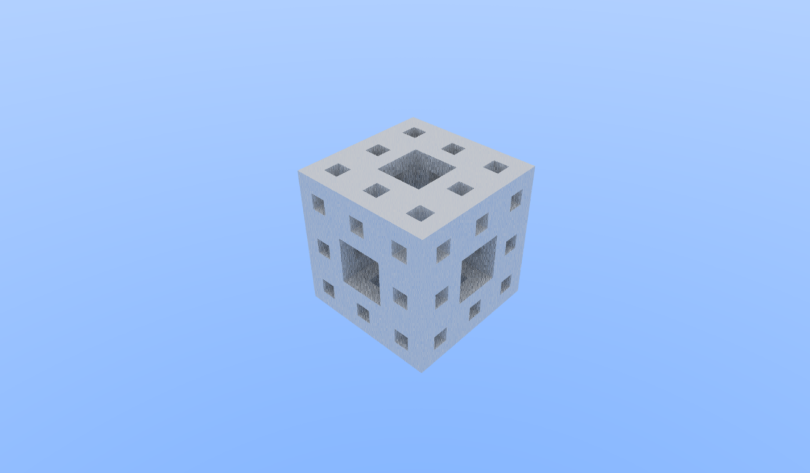
     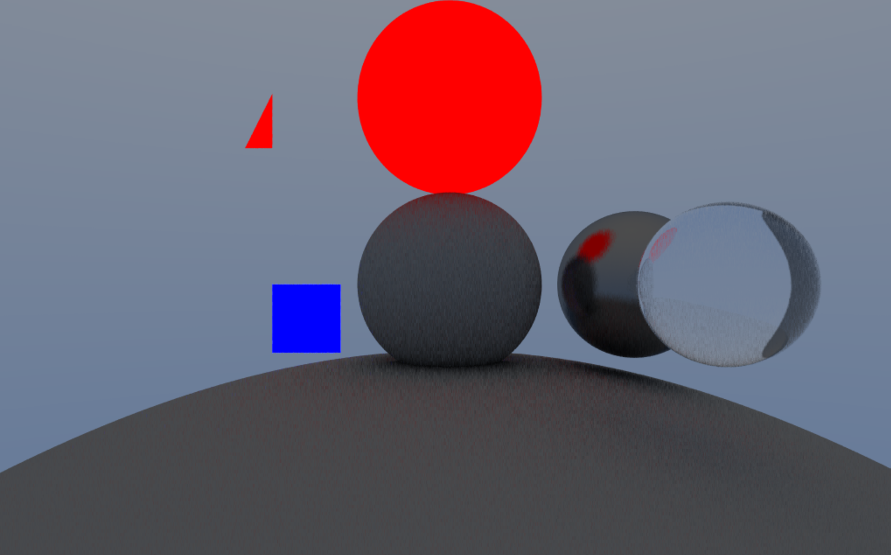
    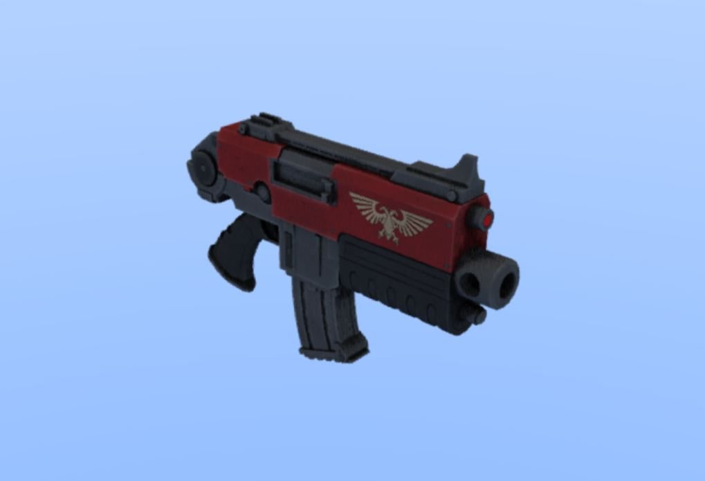
    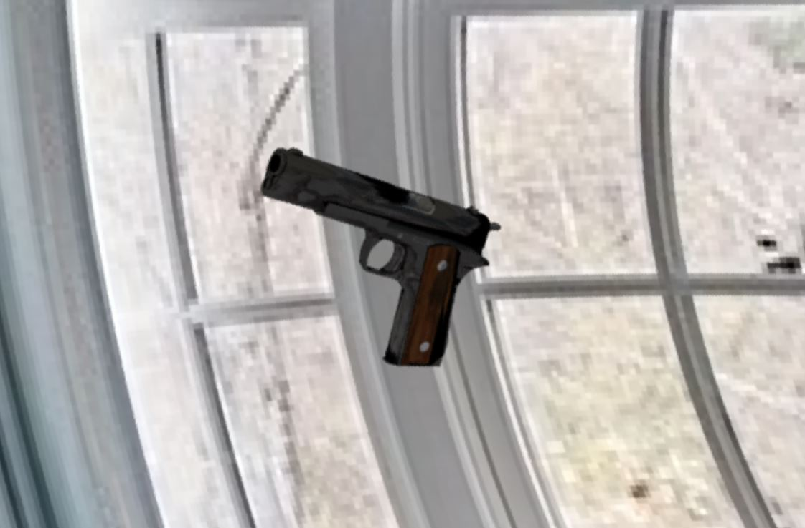
       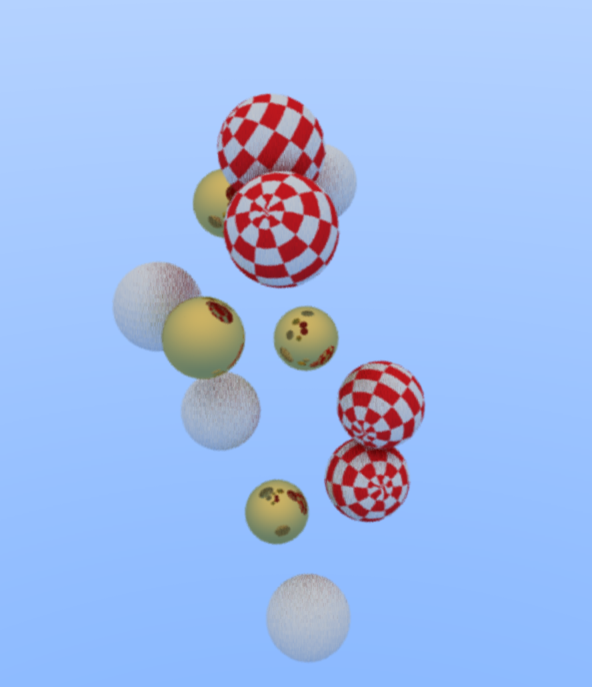
  

Based of of: https://raytracing.github.io/
