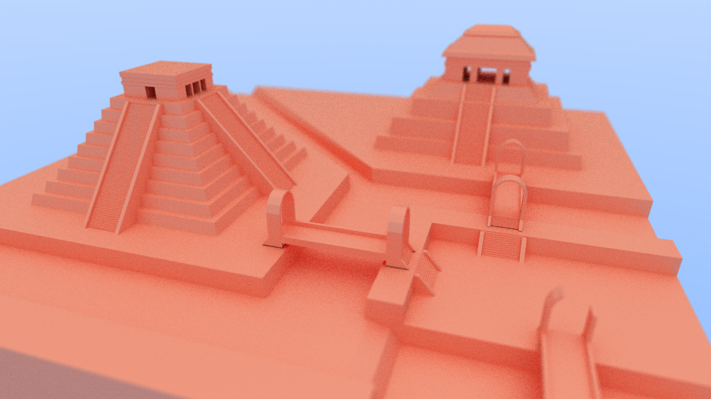
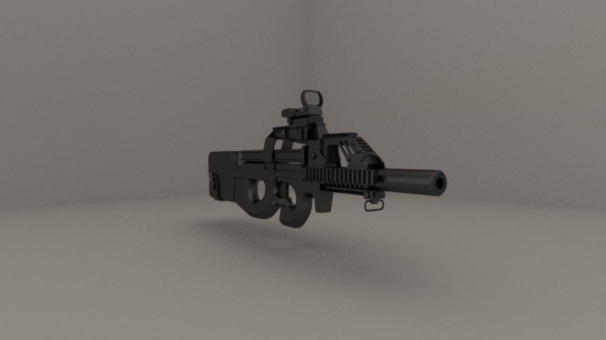
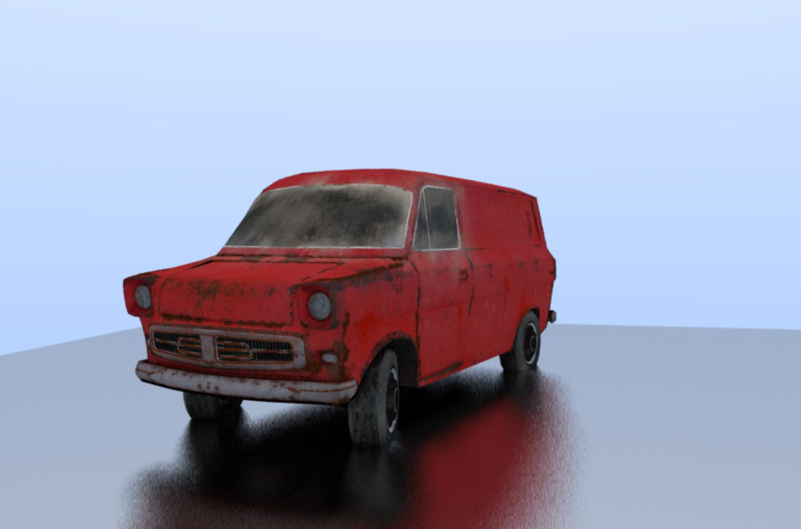

# DOGERAY
CUDA path tracer from scratch!
You can find the project tracker on my profile.

Has been tested with over a million tris!
It is almost realtime. 
Almost all the code is in kernel.cu

Requires CUDA and SDL2

Based of of: https://raytracing.github.io/

tracker here: https://github.com/users/PhilipPragerUrbina/projects/1
###
Gallery:

      
      
       
    
   
   
  
     
   
   
   
    
     
    
    
       
  

